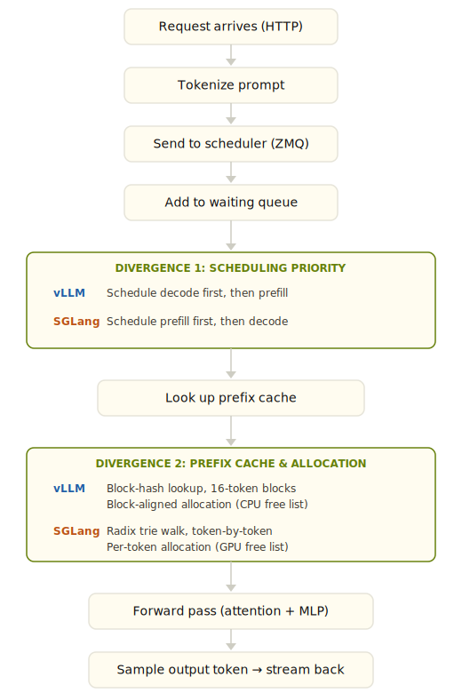

# Inside the Serving Loop: How vLLM and SGLang Actually Handle Your Requests

In my [previous post](/writing/inference/), I benchmarked vLLM and SGLang from the outside — measuring speed and accuracy on structured extraction tasks. The numbers were interesting, but they raised a harder question: *why* do these frameworks perform the way they do?

To find out, I did what any self-respecting engineer would do: I read the code. Both codebases, end-to-end, tracing a single request from API entry to first token output.

What surprised me most wasn't the differences — it was how similar the two frameworks are. They share the same high-level architecture, the same core optimizations, and in many places, nearly identical design decisions. The community discourse sometimes treats them as fundamentally different approaches to inference serving. They're not. They're two implementations of the same ideas, with a few divergence points that *might* matter for performance.

## The Path of a Request

Both frameworks follow the same basic flow. A request arrives over HTTP, gets tokenized, crosses a process boundary via ZMQ to a scheduler, the scheduler decides what to compute and allocates KV cache memory, a GPU worker runs the forward pass, and the first token streams back.

Here's what that looks like, with the two divergence points marked:

<figure class="diagram">

</figure>

Everything outside the green boxes is shared. Same ZMQ transport, same busy-loop scheduling, same "allocate before forward pass" pattern, same streaming output. The green boxes are where the interesting decisions live.

## Divergence 1: Scheduling Priority

The two frameworks schedule prefill and decode work in opposite order.

vLLM runs a decode-first policy. In its `schedule()` loop, it iterates running requests first — these are the decode requests already generating tokens. Only after all running requests are accounted for does it move to the waiting queue for new prefills, and both draw from the same token budget:

```python
# vLLM: v1/core/sched/scheduler.py:357
# First, schedule the RUNNING requests.
req_index = 0
while req_index < len(self.running) and token_budget > 0:
    request = self.running[req_index]
    ...
    token_budget -= num_new_tokens

# v1/core/sched/scheduler.py:535
# Next, schedule the WAITING requests.
while self.waiting and token_budget > 0:
    ...
```

SGLang runs a prefill-first policy. Its `get_next_batch_to_run()` tries to build a prefill batch first, and returns it immediately if one exists. Decode only runs when there's no prefill work pending:

```python
# SGLang: scheduler.py:1935-1955
new_batch = self.get_new_batch_prefill()

if new_batch is not None:
    # Run prefill first if possible
    ret = new_batch
else:
    # Run decode
    if not self.running_batch.is_empty():
        self.running_batch = self.update_running_batch(self.running_batch)
        ret = self.running_batch if not self.running_batch.is_empty() else None
```

The difference doesn't matter much under light load — if the scheduler has spare capacity, both approaches process everything promptly. But under heavy mixed traffic, the policies diverge in what they protect:

- **Decode-first** (vLLM) protects latency for in-flight requests. If you're already generating tokens for a user, your decode steps won't be delayed by a burst of new arrivals. This goes further than just prioritization — if any running request had to be preempted during scheduling (due to insufficient KV cache blocks), the scheduler skips the waiting queue entirely that step. Under memory pressure, it's not decode-first, it's decode-only. The cost is that new requests may sit in the waiting queue longer before their first token.

- **Prefill-first** (SGLang) optimizes for time-to-first-token on new arrivals. Incoming requests get started quickly. But under sustained load, decode steps for in-flight requests could be delayed, potentially increasing inter-token latency for users already mid-response.

This is a genuine architectural tradeoff, not a bug in either implementation. For a chat application where users are sensitive to how quickly a response starts, prefill-first makes sense. For a throughput-oriented pipeline where you want consistent generation speed for in-flight requests, decode-first is the safer choice.

In practice, with chunked prefill enabled (the standard production configuration), the gap narrows — prefill work is broken into chunks that interleave with decode steps, so neither policy fully starves the other. But under memory pressure or bursty traffic, the scheduling order determines which requests degrade first. 

## Divergence 2: Prefix Cache Granularity — Blocks vs. Tokens

When multiple requests share the same system prompt (which is most production workloads), both frameworks try to avoid recomputing the shared prefix by caching the KV values from the first request and reusing them for subsequent ones. The difference is in how fine-grained that caching is.

vLLM caches at block granularity. The default block size is 16 tokens. Only full blocks — blocks completely filled with computed tokens — are hashed and eligible for caching. The rule is explicit in the code:

```python
# vLLM: kv_cache_utils.py:574-576
# "We only hash full blocks"
# end_token_idx = start_token_idx + block_size must be <= num_tokens

# The block count is computed via integer division:
# single_type_kv_cache_manager.py:249
num_full_blocks = num_tokens // self.block_size
```

SGLang caches at token granularity. With the default `page_size=1`, the radix trie matches token by token:

```python
# SGLang: server_args.py:2198-2200
def _handle_page_size(self):
    if self.page_size is None:
        self.page_size = 1

# radix_cache.py:191-198 — _key_match_page_size1
# Matches individual tokens against the trie, one at a time.
# Every token in a shared prefix that exists in the tree is a hit.
```

I sent the same 100-token system prompt twice and measured cached tokens on the second request. The Qwen3-VL chat template adds ~18 tokens of markup, so the actual prompt was 118 tokens. Here's what vLLM does with that, block by block:

- Block 0: tokens 0–15 → hashed as `hash(NONE_HASH, (tok0...tok15))` → cached
- Block 1: tokens 16–31 → hashed as `hash(block0_hash, (tok16...tok31))` → cached
- ...through Block 6: tokens 96–111 → cached
- Tokens 112–117 → partial block. `num_full_blocks = 118 // 16 = 7`, so only 112 tokens enter the cache.

SGLang's radix trie matches all 117 (every token but the last, which must be recomputed for logit generation). The results:

| Framework | Prompt Tokens | Cached (2nd request) | Recomputed |
|-----------|--------------|----------------------|------------|
| vLLM      | 118          | **112**              | 6          |
| SGLang    | 118          | **117**              | 1          |

vLLM cached exactly `floor(118/16) × 16 = 112` tokens. SGLang cached `118 − 1 = 117`. The formulas match the code exactly.

I also swept across different prompt lengths to check alignment effects:

| Content Tokens | Total Prompt | vLLM Cached | SGLang Cached | vLLM Waste |
|---------------|-------------|-------------|---------------|------------|
| 16            | 34          | 32          | 33            | 2 tokens   |
| 17            | 35          | 32          | 34            | 3 tokens   |
| 31            | 49          | 48          | 48            | 1 token    |
| 32            | 50          | 48          | 49            | 2 tokens   |
| 48            | 66          | 64          | 65            | 2 tokens   |
| 49            | 67          | 64          | 66            | 3 tokens   |

vLLM's cached values are always exact multiples of 16. SGLang's are always total − 1. The waste ranges from 1 to 15 tokens depending on alignment (expected average ~8 for random prompt lengths), and it adds up at batch scale: 100 concurrent requests collectively waste ~800 extra prefill tokens. At high-batch prefill throughput for a 4B model (~50,000 tokens/sec), that's roughly 16ms of extra compute. Not catastrophic, but not zero.

### The Radix Cache Remembers Everything — Including Output Tokens

This is the observation I find most interesting, and it required a failed experiment to understand correctly.

Both frameworks cache KV values for the input prompt. But SGLang's radix trie stores the full token path — input *and* output — for every completed request. This means in multi-turn conversations, the second turn's prefix match can extend through the prior turn's output tokens, not just the shared system prompt.

SGLang inserts into its radix cache at two points: during prefill processing (for the input tokens) and at request completion (for the full sequence including output). The completion path is the one that matters for multi-turn caching:

```python
# SGLang: radix_cache.py:459
# cache_finished_req() is called via release_kv_cache() when a request completes.
# It inserts the full token sequence: input + all generated output.
token_ids = (req.origin_input_ids + req.output_ids)[:kv_committed_len]

# The trie receives the complete sequence only at completion time —
# output tokens are NOT inserted incrementally during decode steps.
```

A concrete example of how this helps. `Turn 1: [system prompt] + "What is prefix caching?"` → model generates `"Prefix caching is a technique that..."`. When turn 1 completes, `cache_finished_req` inserts the full path into the radix trie: system prompt, user message, and the entire assistant response. `Turn 2: [system prompt] + "What is prefix caching?" + "Prefix caching is a technique that..." + "Tell me more."` → `match_prefix` walks the trie and matches everything up to the new user message — the entire first turn including the assistant's output tokens. Turn 2 skips recomputing KV for all of turn 1. Only the new user message needs a forward pass.

vLLM can also cache output tokens through its block-hash mechanism — completed blocks are hashed regardless of whether they contain input or output tokens:

```python
# vLLM: kv_cache_utils.py:558
# Block hash is a chained hash:
hash_function((parent_block_hash, curr_block_token_ids_tuple, extra_keys))

# Blocks are hashed when full (16 tokens), in the NEXT scheduling step.
# single_type_kv_cache_manager.py:249 — cache_full_blocks()
```

So vLLM's multi-turn caching works too, but at block granularity with the same alignment constraints. The block hash chain is continuous — a full block spanning the boundary between turn 1's output and turn 2's input gets hashed and cached like any other block. The only waste is the partial block at the very end of the matched prefix, same as the single-turn case.

I initially tested this wrong. My first experiment sent two independent requests with the same input prompt and expected the second request to benefit from the first's output tokens. It didn't — because `match_prefix` walks the trie against the *new request's* token sequence, and request B's input didn't include request A's output. The cached tokens topped out at 117 (prompt only), same as the single-turn test. The lesson: output token sharing requires a future request whose input contains the prior output — the typical multi-turn conversation pattern.

So I ran the correct test. Two-turn conversation: turn 1 generates a 64-token response about Paris, then turn 2 includes that response as history and asks a follow-up question.

| Metric | vLLM | SGLang |
|--------|------|--------|
| Turn-1 prompt tokens | 120 | 120 |
| Turn-1 output tokens | 64 | 64 |
| Turn-2 total prompt tokens | 198 | 198 |
| **Turn-2 cached (cold)** | **176** | **184** |
| Output tokens shared | **56 of 64** | **64 of 64** |

Turn 2's 198 tokens break down as: 120 (original system prompt + turn-1 user message) + 64 (turn-1 assistant output) + 14 (turn-2 user message with chat template markup). SGLang cached 184 of those — everything except the 14-token new user message, minus 1 for the last-token recomputation: `184 = 120 + 64`. The radix trie retained the full completed sequence and `match_prefix` matched it token by token. vLLM cached 176: `floor(184/16) × 16 = 176`. The remaining 8 tokens of the matched prefix sit in a partial block at the tail.

Since the block hash chain is continuous across turn boundaries, the only waste in vLLM is this single partial block at the end of the matched prefix — an average of ~8 tokens regardless of how many turns the conversation has. Multi-turn conversations don't compound the alignment loss at every turn boundary the way I initially expected; there's just one tail.

### Why Blocks?

The numbers above might suggest SGLang's token-granular approach is strictly superior. It isn't — vLLM is making a deliberate trade, and the primary constraint is the GPU, not the data structure.

Attention kernels (FlashAttention, FlashInfer) process KV cache in contiguous fixed-size blocks. vLLM's `allocate_slots()` requires `num_computed_tokens` to be block-size aligned — you can't resume computation from the middle of a block because the kernel doesn't support it. The block size is the unit of GPU memory management, and fixed-size blocks enable efficient paged allocation without fragmentation over long-running sessions.

The hash table on top is a secondary benefit: O(1) lookup per block, and a manageable number of entries (a 100K-token cache with block size 16 is ~6,250 hashes). SGLang's radix trie uses path compression — edges store sequences of tokens, and nodes only split at branching points — so the "millions of nodes" concern is less severe than it might seem. But trie operations (insertion, eviction, node splitting) are still more complex under concurrent access than flat hash lookups. It's worth noting that SGLang also supports `page_size > 1`, which would make its caching block-granular like vLLM's — the token-level default is a choice, not an inherent limitation of the architecture.

The block-alignment tax — an average of ~8 tokens of wasted cache per request — is the price for this GPU-friendly simplicity.

### Is This Difference Noise?

Putting the numbers in perspective: ~8 tokens of cache waste per request, regardless of conversation length, against prompts that grow to thousands of tokens. At batch scale, the extra prefill compute from block alignment is measured in single-digit milliseconds. For most production deployments, this is noise — dominated by network latency, model forward pass time, and queuing delays.

The prefix cache divergence is a real architectural difference, but it's not the difference that will determine which framework you should use. The scheduling policy — what happens when the system is under pressure — is far more likely to matter.

## What to Test Next

The scheduling divergence — decode-first vs prefill-first — is where I expect the real performance difference to emerge, and it requires experiments the code can't answer.

**Memory pressure.** What happens when both frameworks are operating near KV cache capacity? With limited memory headroom, the scheduling policy determines which requests get preempted. Does vLLM's decode-first policy keep in-flight requests alive at the cost of rejecting new ones? Does SGLang's prefill-first policy admit too many new requests, forcing eviction of in-progress work? The recovery cost is more similar than I initially expected: vLLM resets `num_computed_tokens` to 0 on preemption but preserves the request's block hashes, so `get_computed_blocks` can recover cached blocks from the prefix cache when the request is rescheduled. SGLang's retracted requests call `release_kv_cache` with `is_insert=False` — output tokens from decode are lost, but prefill tokens already cached via `cache_unfinished_req` during the initial prefill step survive in the radix trie. Both frameworks lose decode-phase work on preemption; the question is how much of the prefill work each recovers in practice.

**Bursty traffic.** A sustained burst of new requests on top of a steady decode workload. How does each framework's TTFT and inter-token latency respond? The scheduling order should determine which metric degrades first — vLLM should protect inter-token latency while SGLang should protect TTFT.

**Throughput at saturation.** At 80%, 90%, and 100% of capacity — where do the latency distributions diverge? The request flow is identical when the system is comfortable. The differences should only manifest when something has to give.

The idea is to run a simulation of a production workload and measure the performance of each framework under different conditions, and then compare the results to see which framework performs better under different conditions.


